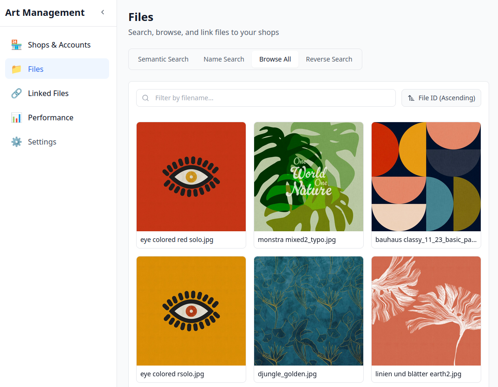
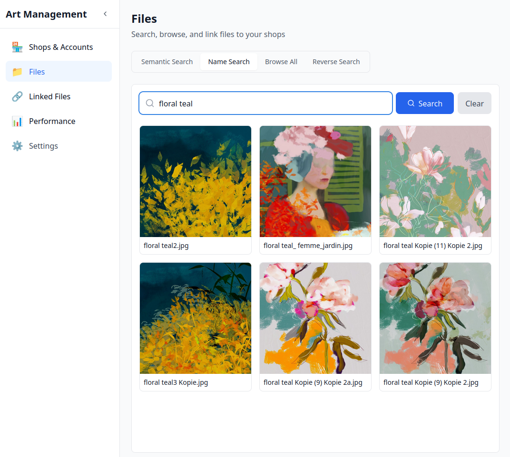
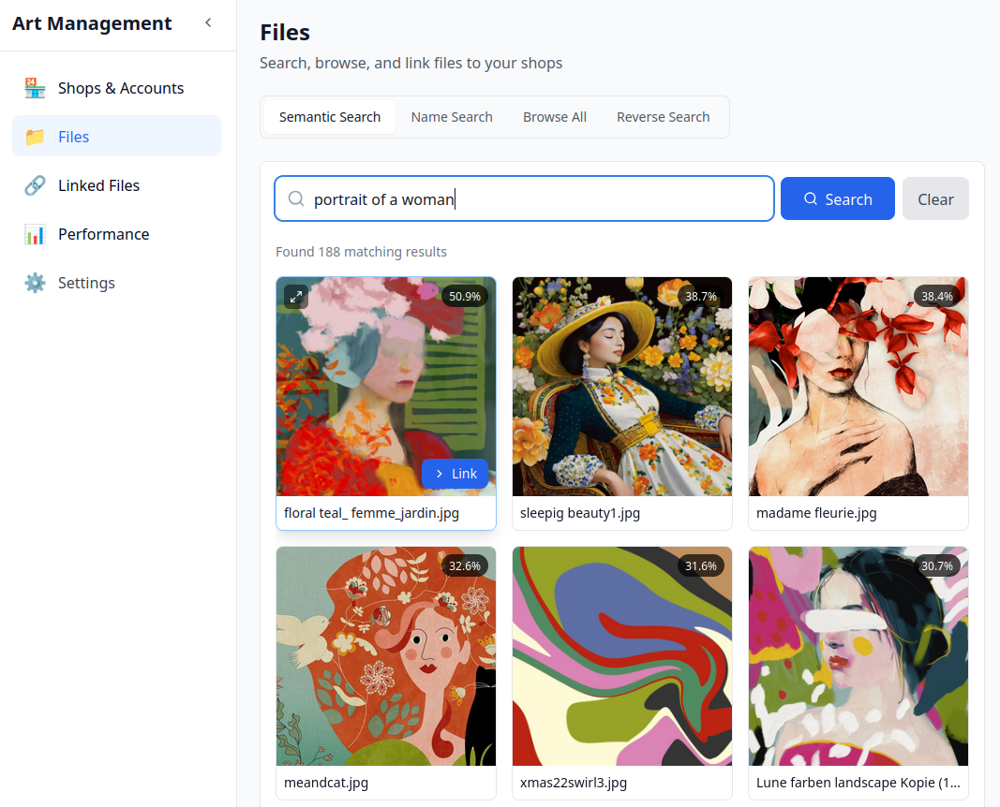
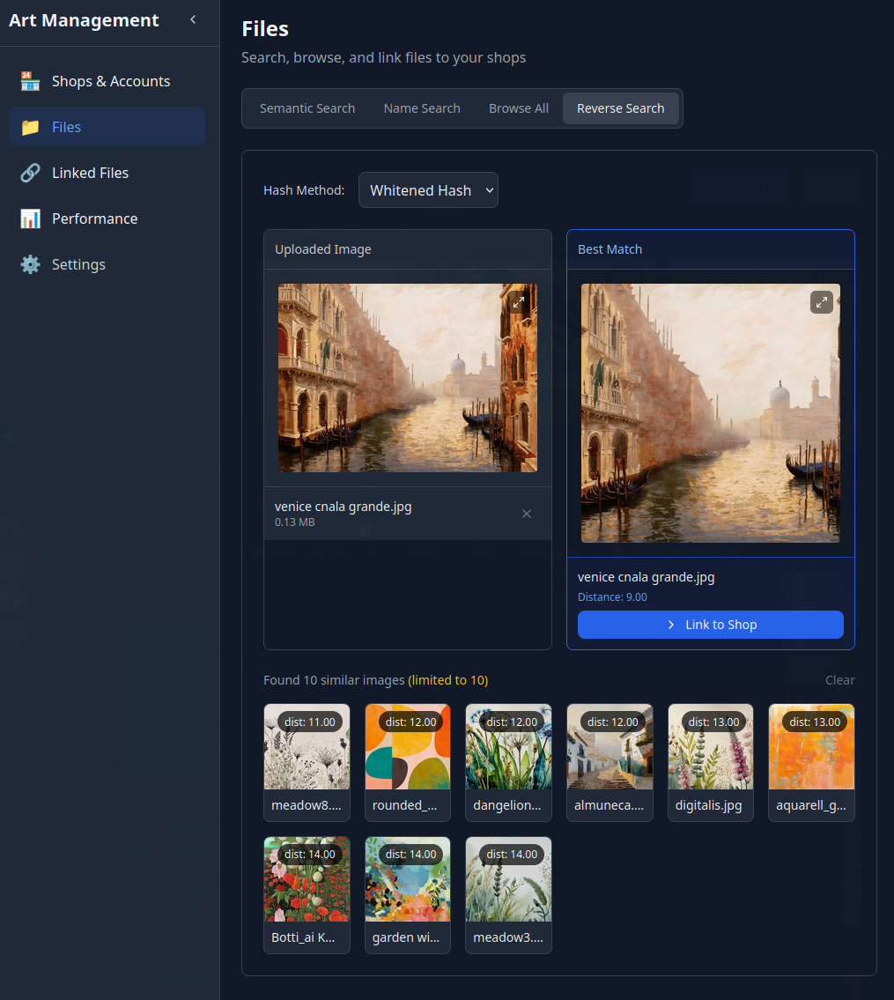
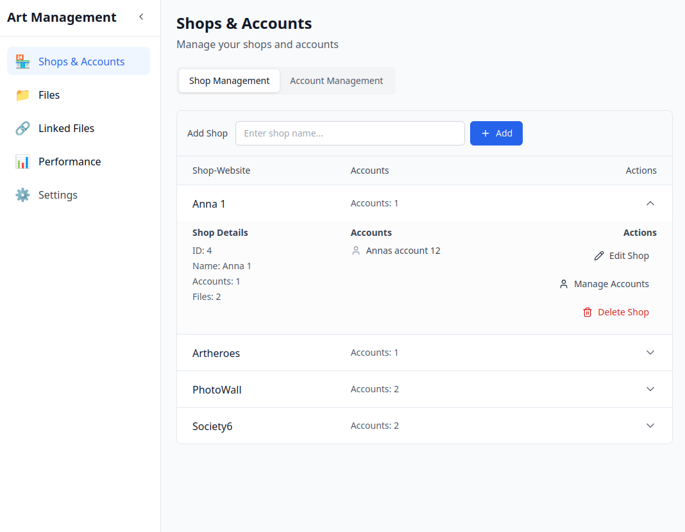
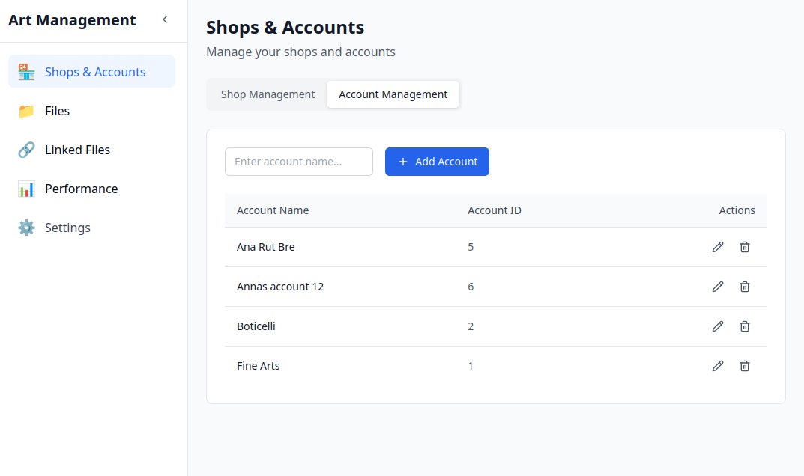
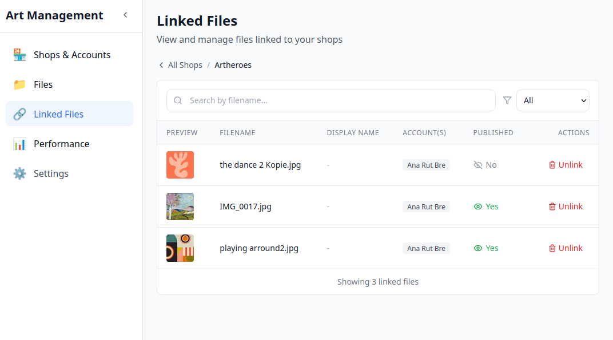
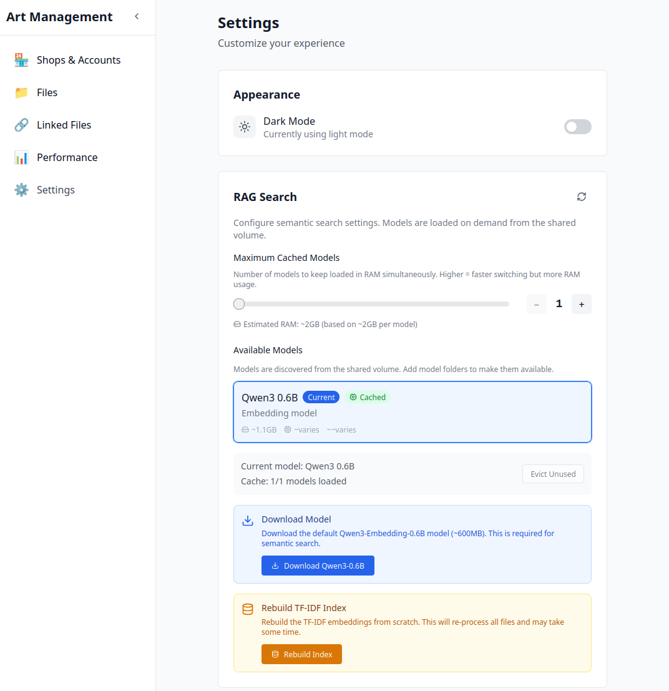
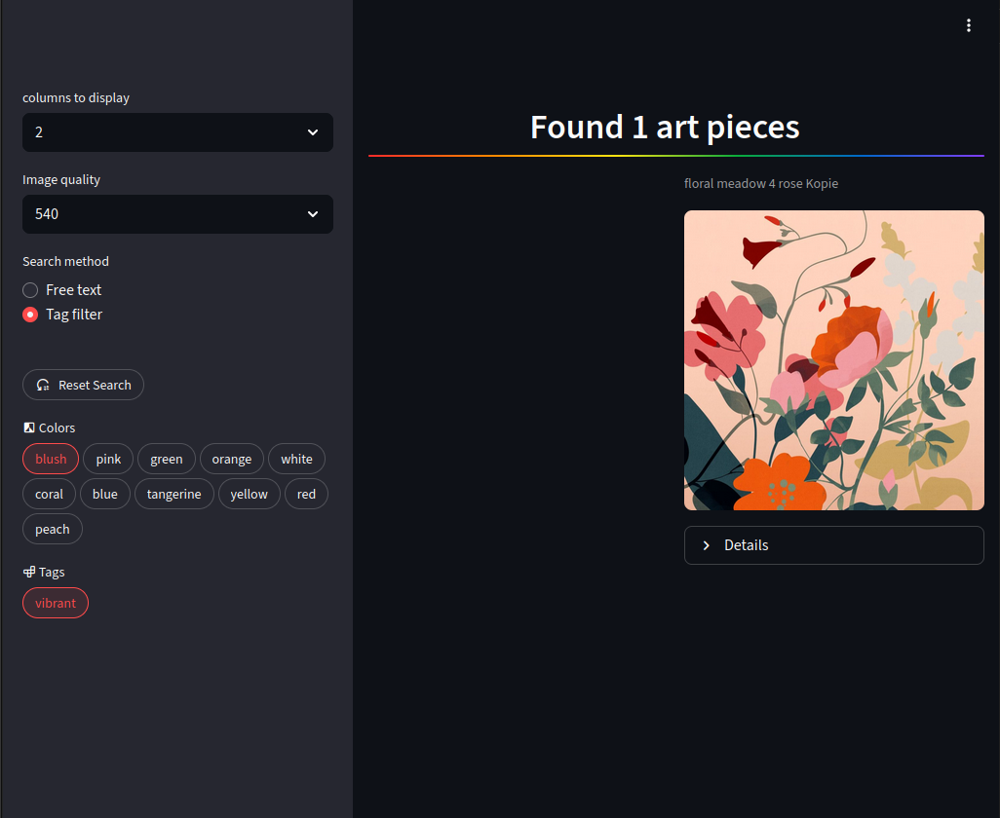

# Fine Arts - Read me
most recent project steps are on top of README.md

---

## 🎨 New Frontend: Art Management App

A modern, full-featured web application for managing fine art files, shops, and accounts. Built with **Nuxt 3**, **Vue 3**, and **Tailwind CSS**, the frontend provides an intuitive interface for browsing, searching, and linking artwork files to online shop accounts.

### Key Features

- **Multi-Method File Search**
  - **Semantic Search (RAG)**: AI-powered similarity search using Qwen3 embedding models with relevance percentages
  - **Name Search**: Fast filename-based text search
  - **Browse All**: Grid-based file browser with thumbnail previews
  - **Reverse Search**: Image-based similarity search using visual fingerprinting to find similar artwork

- **Shop & Account Management**
  - Create and manage multiple shops (Society6, Artheroes, PhotoWall, etc.)
  - Link shop accounts to files
  - Track published status per account

- **Linked Files Dashboard**
  - View all files linked to a specific shop
  - Search by filename within linked files
  - Unlink files with one click

- **RAG Search Configuration**
  - Model selection and caching controls
  - Download and manage embedding models
  - Rebuild TF-IDF index on demand
  - Dark/Light mode toggle

### Screenshots

#### Files - Browse All
Browse your entire art collection in a responsive grid layout with thumbnail previews.



#### Files - Name Search
Quickly find files by searching their filenames.



#### Files - Semantic Search (RAG)
AI-powered search that finds visually similar artwork with relevance scores.



#### Files - Reverse Search
Image-based similarity search that finds visually similar artwork using fingerprinting technology.



#### Shops & Accounts - Shop Management
Manage your online shops and link accounts to files.



#### Shops & Accounts - Account Management
Create and manage shop accounts across all your platforms.



#### Linked Files - Shop View
View and manage all files linked to a specific shop.



#### Settings - RAG Configuration
Configure semantic search models, caching, and index rebuild options.



### Tech Stack

| Layer | Technology |
|-------|-----------|
| Frontend Framework | Nuxt 3 (Vue 3) |
| Styling | Tailwind CSS |
| UI Components | Shadcn Vue |
| Backend API | Nuxt Server Routes |
| RAG Search | Qwen3 Embedding Models + TF-IDF |
| Database | PostgreSQL (via Drizzle ORM) |
| File Storage | Nextcloud WebDAV |
| Deployment | Docker Compose |

---

### Implemented search engine (Legacy Streamlit)
- stream lineing search engine, added two functions:
    - free natural language text search, for now missing operators AND OR NOR, might come later
    - explorative search via tag pills, with two main categories, colors and rest (lol)
- how ever it still needs a backend-change so the initial loading time gets way faster
    - all other functions are quick and easy to use after the first startup
- can download source files via direct link to nextcloud, however only possible with a nextcloud account
- based on streamlit, psql and webdav backend of nextcloud



### Image reverse search
- Starting the image reverse search build.
    - either its going to be hosted in the already availible psql or via a vectordb
    - art pieces will be fingerprinted and probably sliced into 3 feature categories: color, contours and complete sets

### Hosting search engine (local)
- hosted the search engine via docker-compose & cloudflare tunnel behind a login

### Postgres Backend Changes
- added 2 new Views for faster operation of streamlit. Both views load far under 100ms
    - avail_colors: this one checks which tags are colors and gives them back with name & id
    ```sql
    SELECT bas.id,
    bas.is_color,
    st.name AS color_name
    FROM bre_advance_search bas
    JOIN oc_systemtag st ON bas.id = st.id
    WHERE bas.is_color = true;
    ```
    - bre_search_index_live: this one maps the preview files with file ids, names and path. it needs to be extended with the tags, for possibly the biggest performance improvement in streamlit
    ```sql
    SELECT st.id AS tag_id,
    st.name AS tag_name,
    stom.objectid,
    bas.is_color AS color,
    bas.is_adjective,
    bas.lvl3_hyponym,
    bas.hyponym_all
    FROM oc_systemtag st
    JOIN oc_systemtag_object_mapping stom ON stom.systemtagid = st.id
    LEFT JOIN bre_advance_search bas ON st.id = bas.id;
    ```

### Data cleaning
- Since the initial tagging process of the DB is finished, the tags now need to be cleaned.
    - Lemmatized
    - Similarity checked
    - Clustered
    - Hyponyms added, for future similarity calculations
- this will most likely work best with direct interference w/ the psql backend of nextcloud.
- most important tables for this step are:
    - `oc_systemtag`
    - `oc_systemtag_object_mapping`

### Fine-Arts-Webdav
Webdav Repository
- Aim is to get a clean API connection for file download, no more bruteforce
- File and metadata download test successful
    - files wont be written to disk anymore and are kept in ram
    - files metadata is downloaded in a dictionary and saved in a json for testing purposes
    - all folder info and file metadata download is done in +-6 minutes
    - for now its missing tag upload to cloud
    - since most files now do have a thumbnail, it may be worth getting those, instead of the big source files <br>
        - like this ``` GET: https://cloud.yourserver.org/core/preview?fileId=11750924&x=250&y=250 ```
    - json/dict format example:
    ```json
    {
        "AI_art/": {
            "bearbeitet/": {
                "1265.jpg": {
                    "name": "1265.jpg",
                    "id": "00019515s6w8qwy7q",
                    "fileid": "195",
                    "tags": null,
                    "path": "/path/to/file/1265.jpg"
                }
            }
        }
    }
    ```

## Postgres - Where to Find What Data
- File Locations are availible in Table `oc_filechache` in column `path`
- File tags are availible in Table `oc_systemtag`
- File tag mappings are availible in Table `oc_systemtag_object_mapping`

## Cloud - Docker env setup
The Docker-Compose.yml is an all in one Setup file for this work environment.
It is important to setup an .env file for the environment credentials & settings.
- _See files in `docker-compose-setup`_
- ```mkdir``` & ```chown 775``` your volume path
- Install from folder with `docker compose up -d`

It includes a Nextcloud installation which is published via a cloudflare tunnel.
The Nextcloud Database is PSQL and can be accessed via ssh/5432.
Nextcloud is used as Source Database. <br>
It will be extended via another Database to save progress from development and more importantly the classified data and other results.
